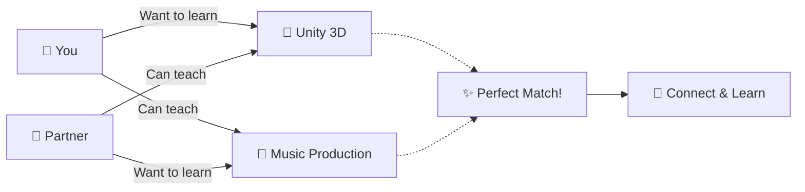

<div align="center">

# 🔄 SkillSwap

### *Learn Anything. Teach Anything. Trade Skills, Not Money.*

[](https://skills-swap-alpha.vercel.app/)
[](https://youtu.be/vWesqjunAgo)
[](https://github.com/gandhiatharv/SkillSwap)

**The world's first platform where you learn any skill for free by teaching what you know.**

[Get Started](#-quick-start) • [How It Works](#-how-it-works) • [Features](#-features) • [Tech Stack](#️-tech-stack)

---


</div>

---

## 🎯 What is SkillSwap?

Imagine wanting to learn **Unity 3D** but courses are too expensive, and volunteer tutors don't offer it. Now imagine you already know **Music Production**. What if you could find someone who knows Unity and wants to learn Music Production?

**That's SkillSwap.** 

We match people who can teach each other's desired skills—creating a **mutual learning partnership** where both sides win. No money. No generic courses. Just **1-on-1, accountable, live learning**.

### 🌟 Why This Matters

- **Traditional courses** → Not interactive, expensive, no accountability
- **Volunteer tutoring** → Limited subjects, group classes, inflexible curricula  
- **SkillSwap** → **Free, personalized, mutual, global**

---

## ⚡ Quick Start

### Try It Now (No Installation)
**👉 [Launch SkillSwap](https://skills-swap-alpha.vercel.app/)**

1. **Register** an account
2. **Select skills** you want to learn and can teach
3. **Get matched** with learning partners worldwide
4. **Message & video call** to schedule sessions
5. **Start learning!**

### Run Locally
```bash
# Clone the repository
git clone https://github.com/gandhiatharv/SkillSwap.git
cd SkillSwap

# Install dependencies
pip install -r requirements.txt
npm install

# Run backend
python app.py

# Run frontend (in new terminal)
npm start
```

---

## 🚀 How It Works

<div align="center">



</div>

### 📋 Three Simple Steps

| Step | Action | What Happens |
|------|--------|-------------|
| **1️⃣ Select** | Choose from **335+ skills** across 15 categories | Browse tech, arts, business, fitness, languages & more |
| **2️⃣ Match** | Our algorithm finds your perfect partners | Get **exact**, **subcategory**, and **category** matches |
| **3️⃣ Learn** | Message, video call, and exchange knowledge | Build lasting learning partnerships worldwide |

---

## ✨ Features

### 🧠 Smart 3-Tier Matching System

| Tier | Description | Example |
|------|-------------|---------|
| ⭐ **Exact Match** | Teaches *exactly* what you want to learn | You want **Unity 3D** → Match teaches **Unity 3D** |
| 🎯 **Subcategory Match** | Teaches related skills in same subcategory | You want **Unity 3D** → Match teaches **Blender** (both 3D & Animation) |
| 📂 **Category Match** | Teaches skills in broader category | You want **Unity 3D** → Match teaches **UI/UX** (both Arts & Design) |

### 💬 Real-Time Communication

- **Instant Messaging**: WebSocket-powered chat with all your matches
- **Video Calling**: Built-in video conferencing—no external apps needed
- **Active Now**: See who's online right now and ready to connect

### 📊 Personalized Dashboard

- View all your matches with detailed compatibility scores
- Track conversations and upcoming sessions
- See active users you might want to reach out to

### 🌍 Global Skill Library

<details>
<summary><b>335+ Skills Across 15 Categories</b> (Click to expand)</summary>

- 💻 **Programming & Development** (Python, JavaScript, Unity, React, etc.)
- 🎨 **Arts & Design** (Graphic Design, UI/UX, 3D Animation, Photography)
- 🎵 **Music & Audio** (Music Production, Guitar, Piano, Singing)
- 🏋️ **Health & Fitness** (Yoga, Personal Training, Nutrition, Martial Arts)
- 💼 **Business & Marketing** (SEO, Social Media, Public Speaking, Finance)
- 🌐 **Languages** (Spanish, Mandarin, French, Japanese, Sign Language)
- 🔬 **Science & Engineering** (Data Science, Robotics, Chemistry, Physics)
- ✍️ **Writing & Content** (Copywriting, Creative Writing, Blogging)
- 🎬 **Video & Film** (Video Editing, Filmmaking, Animation)
- 🧘 **Lifestyle & Personal Development** (Meditation, Time Management, Cooking)
- 📚 **Academic Subjects** (Math, History, Literature, Test Prep)
- 🎮 **Gaming & Esports** (Game Design, Streaming, Competitive Gaming)
- 🛠️ **Trades & Crafts** (Woodworking, Electrical, Plumbing, Knitting)
- 🌱 **Sustainability & Environment** (Gardening, Renewable Energy, Zero Waste)
- 🐾 **Animals & Nature** (Pet Training, Wildlife Conservation, Horseback Riding)

*And many more!*

</details>

---

## 🎥 See It In Action

<div align="center">

[](https://youtu.be/vWesqjunAgo)

**[▶️ Watch Full Demo Video](https://youtu.be/vWesqjunAgo)**

</div>

---

## 🛠️ Tech Stack

<div align="center">

### Frontend


### Backend


### Real-Time


### Database & Deployment


</div>

### Architecture Highlights

- **Multi-tier matching algorithm** (exact → subcategory → category fallback)
- **WebSocket connections** for instant messaging
- **WebRTC peer connections** for video calling
- **RESTful API endpoints** for skill data loading
- **Secure authentication** with session management

---

## 🌟 Why SkillSwap is Different

| Other Platforms | SkillSwap |
|----------------|-----------|
| 💰 Pay for courses | ✅ **Completely free** |
| 👥 Group classes with fixed curriculum | ✅ **1-on-1 personalized learning** |
| 📺 Pre-recorded videos | ✅ **Live, interactive sessions** |
| ❌ No accountability | ✅ **Mutual commitment keeps both sides engaged** |
| 🌍 Limited to what's offered | ✅ **Learn ANY skill—if it exists, someone can teach it** |

---

## 💡 The Story Behind SkillSwap

> *"I was building a philosophy video game in Unity and needed to learn character movement. Online courses didn't keep me accountable. Volunteer tutors didn't offer Unity. Classes were too expensive. I realized: **What if I could trade my Music Production skills for someone's Unity knowledge?** That question became SkillSwap."*

**The Big Idea**: Everyone wants to learn something. Everyone can teach something. By connecting these dots, we solve both problems at once.

---

## 🔮 What's Next? (Version 2.0)

### ⏱️ Time Banking System

Currently, SkillSwap requires **mutual matches** (you teach what they want, they teach what you want). But what if matches are one-sided?

**Solution: Time Credits**
- Teach someone for 1 hour → Earn **60 Time Credits**
- Use credits to learn from someone who *isn't* a mutual match
- Creates a **circular economy of knowledge**

**Example:**
```
Person X (wants Unity, teaches Music) 
    ↓ gives 60 credits
Person Y (teaches Unity, wants Photography)
    ↓ gives 60 credits  
Person Z (teaches Photography, wants Music)
    ↓ gives 60 credits back to Person X
```

Everyone learns. Everyone teaches. The cycle continues. 🔄

---

## 🏆 Recognition

🥇 **Congressional App Challenge Submission** (NY-16 District)  
🎓 Completed as an independent project at home  
📅 Completed: October 29, 2025

---

## 🤝 Contributing

Want to improve SkillSwap? Contributions are welcome!

1. Fork the repository
2. Create a feature branch (`git checkout -b feature/AmazingFeature`)
3. Commit changes (`git commit -m 'Add AmazingFeature'`)
4. Push to branch (`git push origin feature/AmazingFeature`)
5. Open a Pull Request

---

## 📬 Contact & Feedback

Have suggestions? Found a bug? Want to share your SkillSwap success story?

- **Feedback Form**: Available in the app's Contact page
- **GitHub Issues**: [Report bugs or request features](https://github.com/gandhiatharv/SkillSwap/issues)

---

## 📄 License

This project is open source and available under the [MIT License](LICENSE).

---

<div align="center">

### 🚀 Ready to Trade Skills?

**Stop paying for courses. Start learning from real people.**

[](https://skills-swap-alpha.vercel.app/)

---

**Made with ❤️ by someone who just wanted to learn Unity**

*⭐ Star this repo if you believe knowledge should be free and accessible to all!*

</div>
